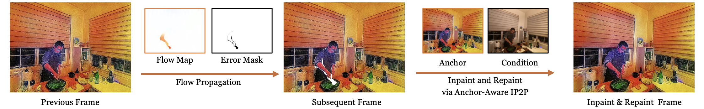
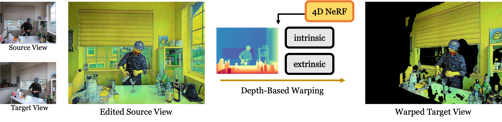

  <!-- <a href=https://arxiv.org/abs/2406.09402></a> <a href='https://immortalco.github.io/Instruct-4D-to-4D/'></a>  -->

<div align="center">

# Instruct 4D-to-4D: Editing 4D Scenes as Pseudo-3D Scenes Using 2D Diffusion

[](https://arxiv.org/abs/2406.09402) [](https://openaccess.thecvf.com/content/CVPR2024/papers/Mou_Instruct_4D-to-4D_Editing_4D_Scenes_as_Pseudo-3D_Scenes_Using_2D_CVPR_2024_paper.pdf) [](https://immortalco.github.io/Instruct-4D-to-4D/)

</div>


This is the official implementation of [Instruct 4D-to-4D](https://immortalco.github.io/Instruct-4D-to-4D/).
## 🔧 Installation

### Environmental Setups

```bash
git clone https://github.com/Friedrich-M/Instruct-4D-to-4D.git
cd Instruct-4D-to-4D
conda create -n instruct4d python=3.8
conda activate instruct4d
pip install torch==2.0.1+cu118 torchvision==0.15.2+cu118 --index-url https://download.pytorch.org/whl/cu118
pip install -r requirements.txt
```

### Data Preparation

**For multi-view 4D scenes.** You can download scenes from [DyNeRF Dataset](https://github.com/facebookresearch/Neural_3D_Video/releases/tag/v1.0).
```bash
mkdir -p data/neural_3d && cd data/neural_3d
# take coffee_martini as an example
wget https://github.com/facebookresearch/Neural_3D_Video/releases/download/v1.0/coffee_martini.zip && unzip coffee_martini.zip && cd ../..
# run the following command to generate the images
python tools/prepare_video.py data/neural_3d/coffee_martini
```

**For single-view 4D scenes.** You can download scenes from [DyCheck Dataset](https://drive.google.com/drive/folders/1ZYQQh0qkvpoGXFIcK_j4suon1Wt6MXdZ).


## 🚀 Training

To edit a 4D scene, you must first train a regular 4D NeRF using your data. For example:
```bash
python stream_train.py --config configs/n3dv/train_coffee_50_2.txt \
    --datadir ./data/neural_3d/coffee_martini \
    --basedir ./log/neural_3d \
    --render_test 1 --render_path 1  
```

Once you have fully trained your scene, the checkpoints will be saved to the `log` directory. We also provide some checkpoints of pre-trained 4D NeRF [here](https://drive.google.com/drive/folders/1ftH5OavgcHS_NTbc1dlDknhZKLhzOdXy?usp=sharing). You can download and put them into the `log` directory. The filename should be like `train_{scene_name}_{num_frames}_{downsample_factor}`.

To start training for editing the NeRF, run the following command:
```bash
python stream_edit.py --config configs/n3dv/edit_coffee_50_2.txt \
    --datadir data/neural_3d/coffee_martini \
    --basedir log/neural_3d --expname edit_coffee_50_2 \
    --ckpt log/neural_3d/train_coffee_50_2/ckpt-99999.th \
    --prompt 'What if it was painted by Van Gogh?' \
    --guidance_scale 9.5 --image_guidance_scale 1.5 \
    --diffusion_steps 20 --refine_num_steps 600 --refine_diffusion_steps 4 \
    --restview_refine_num_steps 700 --restview_refine_diffusion_steps 6
```
*4D Editing tips:*
- Since we use the **Parallelization** scheme, please make sure you have at least 2 GPUs available. 
- If you encounter the CUDA OOM issue, please try to reduce the sequence length of Anchor-Aware IP2P.

> If you have any other questions, please feel free to open an issue.

## 🔥 Framework
> We provide some demos below for better understanding our framework components.

Please dive into the `ip2p_models` directory and download the example files from [Google Drive](https://drive.google.com/file/d/1aNwZ4prQk6z1DJtIg9ssNroTbBK6YLnK/view?usp=drive_link).

```bash
gdown 1aNwZ4prQk6z1DJtIg9ssNroTbBK6YLnK
```

### (1) Anchor-Aware Instruct-Pix2Pix (IP2P)

To enable InsturctPix2Pix simultaneously edit multiple frames and achieve **within-batch consistency**, we modify the attention and convolution structure of original IP2P.
```bash
# Single IP2P
python test_ip2p.py --image_path ./examples/coffee_frame_2x/0.png \
    --prompt 'What if it was painted by Van Gogh?' \
    --resize 1024 --steps 20 \
    --guidance_scale 10.5 --image_guidance_scale 1.5
# Anchor-Aware IP2P
python test_ip2p_sequence.py --image_dir ./examples/coffee_frame_2x/ \
    --prompt 'What if it was painted by Van Gogh?' \
    --sequence_length 6 --resize 1024 --steps 20 \
    --guidance_scale 10.5 --image_guidance_scale 1.5
```

### (2) Key Pseudo-View Editing (Temporal Consistency)

Along the temporal dimension, to achieve **cross-batch consistency** in long-term sequence editing, we propose flow-guided sliding window warping, with anchor-aware IP2P painting.



```bash
# Flow-Guided Warping
python test_flow.py \
    --source_img ./examples/coffee_frame_2x/3.png \
    --target_img ./examples/coffee_frame_2x/6.png
# Sliding Window Warping w/ Anchor-Aware IP2P Painting
python test_flow_sequence.py \
    --image_dir ./examples/coffee_frame_2x/ \
    --prompt 'What if it was painted by Van Gogh?' \
    --sequence_length 6 --resize 1024 \
    --guidance_scale 10.5 --image_guidance_scale 1.5 \
    --painting_diffusion_steps 5 --painting_num_train_timesteps 600
```

### (3) Pseudo-View Propagation (Spatial Consistency)

According to the principal of Perspective Transformation, we could use rendered depth from 4D NeRF with the camera parameters to warp the edited pseudo-view to the target view, while maintaining **spatial consistency**.



```bash
# Depth-Based Warping
python test_depth.py \
    --source_img ./examples/coffee_cam_2x/0.png \
    --target_img ./examples/coffee_cam_2x/1.png \
    --prompt 'What if it was painted by Van Gogh?' \
    --guidance_scale 10.5 --image_guidance_scale 1.5 \
    --pts_path ./examples/pts_0.pt --warp_path ./examples/warp_0.pt
```

## 📂 Notes

[1] **2D Editing Quality.** If your edit isn't working as you desire, it is likely because InstructPix2Pix struggles with your images and prompt. We recommend taking one of your images and trying to edit it in 2D first with InstructPix2Pix, referring to the tips on getting a good edit can be found [here](https://github.com/timothybrooks/instruct-pix2pix#tips).
```bash
python test_ip2p.py --image_path $IMAGE_PATH --prompt $PROMPT
```

[2] **4D Scene Representation.** Our framework is general, and therefore, any 4D scene representation adopting RGB observations as supervision can be used. We encourage to extend our editing pipeline to **4D Gaussian Splatting** to make the editing more efficient.

## Acknowledgement

We would like to thank [Liangchen Song](https://lsongx.github.io/index.html) for providing the codebase of [NeRFPlayer](https://lsongx.github.io/projects/nerfplayer.html) and helpful discussion. We also sincerely thank [Haque, Ayaan](https://www.ayaanzhaque.me/) for kind discussion about 3D scene editing.

## 📝 Citation

You can find our paper on [arXiv](https://arxiv.org/abs/2406.09402).

If you find this code or find the paper useful for your research, please consider citing:

```
@inproceedings{mou2024instruct,
  title={Instruct 4D-to-4D: Editing 4D Scenes as Pseudo-3D Scenes Using 2D Diffusion},
  author={Mou, Linzhan and Chen, Jun-Kun and Wang, Yu-Xiong},
  booktitle={Proceedings of the IEEE/CVF Conference on Computer Vision and Pattern Recognition},
  pages={20176--20185},
  year={2024}
}
```