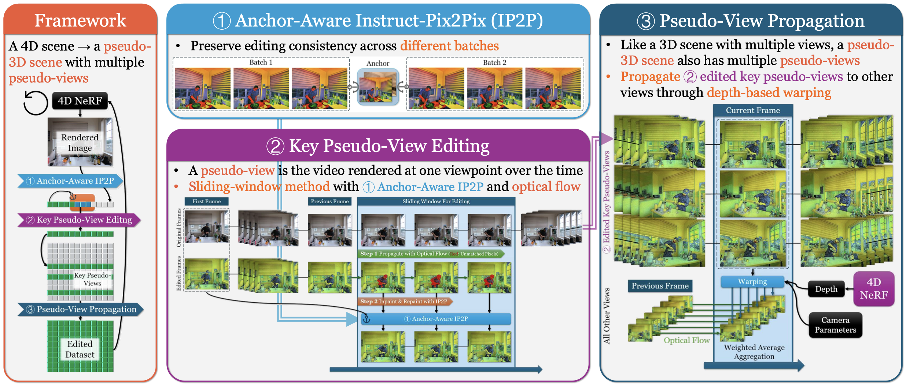
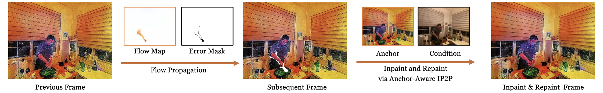
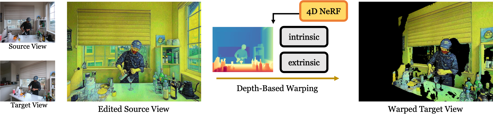

<div align="center">

# Instruct 4D-to-4D: Editing 4D Scenes as Pseudo-3D Scenes Using 2D Diffusion

[](https://arxiv.org/abs/2406.09402) [](https://openaccess.thecvf.com/content/CVPR2024/papers/Mou_Instruct_4D-to-4D_Editing_4D_Scenes_as_Pseudo-3D_Scenes_Using_2D_CVPR_2024_paper.pdf) [](https://immortalco.github.io/Instruct-4D-to-4D/) [](https://opensource.org/licenses/MIT)

</div>



> [Instruct 4D-to-4D: Editing 4D Scenes as Pseudo-3D Scenes Using 2D Diffusion](https://arxiv.org/abs/2406.09402) \
> Linzhan Mou, Jun-Kun Chen, Yu-Xiong Wang \
> CVPR 2024

<details>
<summary><b>How it works</b></summary>

Editing a 4D scene with a text instruction is hard because a 2D image editor has no memory: run it on each frame and each frame comes back with its own interpretation of the prompt, and the radiance field averages the disagreement into blur. This work treats the 4D scene as a *pseudo-3D* scene and enforces consistency in three places:

1. **Anchor-aware InstructPix2Pix** edits a whole batch of frames in one diffusion pass, with every frame attending to a shared anchor, so they come back with one appearance rather than several.
2. **Flow-guided sliding window** carries that edit along time. Each window is initialised by warping the previous frame forward with optical flow, and only the regions the flow cannot explain are repainted.
3. **Depth-based warping** carries the edit across viewpoints, reprojecting an edited view into its neighbours through the depth the field renders.

</details>

## 🧷 News

- **[2024-09-22]** The single-view setting codebase is released.
- **[2024-08-29]** The multi-view setting codebase is released.

## 📁 Repository layout

```
instruct4d/            the library
├── ip2p/              anchor-aware InstructPix2Pix (component 1)
├── editing/           temporal propagation and depth warping (components 2, 3)
├── flow/              vendored RAFT plus flow warping helpers
├── fields/            streaming TensoRF 4D scene representation
├── data/              DyNeRF loader and camera-ray construction
├── rendering/         volumetric rendering and evaluation
├── training/          ray samplers and the optimisation step
└── config.py          the shared option set

train.py               reconstruct a 4D NeRF          (multi-view)
edit.py                edit it with an instruction    (multi-view)
render.py              render from a checkpoint       (multi-view)
configs/n3dv/          per-scene settings
scripts/               ready-to-run wrappers for the three entry points
demos/                 one runnable demo per framework component
tools/                 dataset preparation
tests/                 CPU unit tests, no data or weights needed
assets/                figures used by this README
nerfplayer-nerfstudio/ the single-view setting, on a NeRFPlayer backbone
```

## 🔧 Installation

The two settings need **separate environments**. NeRFStudio 0.3.2 pins `diffusers==0.16.1`, which predates the API the anchor-aware UNet is built on, so one environment cannot serve both. They share the `instruct4d` library, which is installed into each.

```bash
git clone https://github.com/Friedrich-M/Instruct-4D-to-4D.git
cd Instruct-4D-to-4D
```

### Multi-view setting

```bash
conda create -n instruct4d python=3.10 && conda activate instruct4d

# Pick the wheel matching your CUDA build from https://pytorch.org/get-started/locally/
pip install "torch>=2.13" torchvision

pip install -r requirements.txt
pip install -e .
```

The requirements set floors rather than exact pins, so the install picks up security fixes. The pseudo-3D UNet reaches into diffusers internals that have moved between releases; `instruct4d/ip2p/_compat.py` bridges those, and the editing path is tested against diffusers 0.19 through 0.40.

### Single-view setting

Install NeRFStudio and the NeRFPlayer backbone, then move diffusers back up to a version the anchor-aware UNet supports. NeRFStudio only uses its older diffusers in `nerfstudio.generative` (the Generfacto text-to-3D method), which this repository never touches, so the override is safe. See the [NeRFStudio](https://github.com/nerfstudio-project/nerfstudio) repository for the full backbone instructions.

```bash
conda create -n instruct4d-sv python=3.10 && conda activate instruct4d-sv

pip install "torch>=2.13" torchvision
pip install ninja git+https://github.com/NVlabs/tiny-cuda-nn/#subdirectory=bindings/torch
pip install -e nerfplayer-nerfstudio   # pulls nerfstudio 0.3.2
pip install -e .                       # the shared instruct4d library

# nerfstudio pins an older diffusers for a method this repository does not use.
pip install --no-deps --upgrade -r requirements.txt
```

### RAFT weights

Both settings need the RAFT `raft-things` checkpoint, which is not shipped:

```bash
mkdir -p weights
# From the RAFT release: https://github.com/princeton-vl/RAFT
gdown 1MqDajR89k-xLV0HIrmJ0k-n8ZpG6_suM -O weights/raft-things.pth
```

## 📦 Data

**Multi-view 4D scenes** come from the [DyNeRF dataset](https://github.com/facebookresearch/Neural_3D_Video/releases/tag/v1.0).

```bash
mkdir -p data/neural_3d && cd data/neural_3d
wget https://github.com/facebookresearch/Neural_3D_Video/releases/download/v1.0/coffee_martini.zip
unzip coffee_martini.zip && cd ../..

# Explode the videos into frames/<camera>/<index>.jpg
python tools/prepare_video.py data/neural_3d/coffee_martini
```

**Single-view 4D scenes** come from the [DyCheck dataset](https://drive.google.com/drive/folders/1cBw3CUKu2sWQfc_1LbFZGbpdQyTFzDEX).

The config files assume `./data`, `./log` and `./cache` inside the repository. Override them with `--datadir`, `--basedir` and `--cache` if your data lives elsewhere.

## 🚀 Multi-view setting

### 1. Reconstruct

Editing starts from a field that already reproduces the scene, so train one first:

```bash
python train.py --config configs/n3dv/train_coffee_50_2.txt \
    --render_test 1 --render_path 1
```

Checkpoints land in `log/neural_3d/<expname>/`, alongside the resolved config that `edit.py` and `render.py` read back. Pre-trained checkpoints are available [here](https://drive.google.com/drive/folders/1ftH5OavgcHS_NTbc1dlDknhZKLhzOdXy?usp=sharing); put them under `log/` with a directory named `train_<scene>_<frames>_<downsample>`.

### 2. Edit

```bash
python edit.py --config configs/n3dv/edit_coffee_50_2.txt \
    --ckpt log/neural_3d/train_coffee_50_2/ckpt-99999.th \
    --prompt 'What if it was painted by Van Gogh?' \
    --guidance_scale 9.5 --image_guidance_scale 1.5 \
    --diffusion_steps 20 \
    --refine_diffusion_steps 4 --refine_num_steps 600 \
    --restview_refine_diffusion_steps 6 --restview_refine_num_steps 700 \
    --ip2p_device cuda:1
```

The field is re-optimised on the main GPU while the diffusion model edits frames on `--ip2p_device`, so **two GPUs are expected**. Pass `--save_debug_images` to write the intermediate renders, warps and edits under the log directory.

### 3. Render

```bash
python render.py --config configs/n3dv/train_coffee_50_2.txt \
    --ckpt log/neural_3d/edit_coffee_50_2/ckpt-14999.th \
    --render_test 1 --render_path 1
```

`scripts/train.sh`, `scripts/edit.sh` and `scripts/render.sh` wrap these three commands with the defaults above.

## 🚀 Single-view setting

The single-view setting uses the [NeRFStudio](https://github.com/nerfstudio-project/nerfstudio) version of [NeRFPlayer](https://github.com/lsongx/nerfplayer-nerfstudio) as the backbone. There are no other cameras to be consistent with, so only the temporal half of the method applies. Work inside `nerfplayer-nerfstudio/`:

```bash
cd nerfplayer-nerfstudio

sh scripts/train.sh                       # reconstruct
LOAD_DIR=<path>/nerfstudio_models sh scripts/edit.sh     # edit
LOAD_DIR=<path>/nerfstudio_models sh scripts/render.sh   # render a video
LOAD_DIR=<path>/nerfstudio_models sh scripts/in2n.sh     # Instruct-NeRF2NeRF baseline
```

`LOAD_DIR` is the `nerfstudio_models` directory of the run you want to start from; each run gets a timestamped directory, so there is no default that will work for you. Pre-trained checkpoints are available [here](https://drive.google.com/drive/folders/18yMsfZI2h45YO6Hx7bVWiA6XvXtU6_Dp?usp=drive_link).

## 🔥 Framework components

Each of the three components has a standalone demo, so you can see what it does on its own before running a full edit. They read an example bundle of a few frames plus the point cloud a trained field produced:

```bash
gdown 1aNwZ4prQk6z1DJtIg9ssNroTbBK6YLnK && unzip examples.zip
```

```
examples/
├── coffee_frame_2x/   frames 0..N of one camera, for the temporal demos
├── coffee_cam_2x/     one timestamp seen from several cameras, for the spatial demo
├── pts_0.pt           per-view world points, rendered from a trained field
└── warp_0.pt          per-view-pair pixel maps derived from those points
```

All demos write to `./demo_output` unless you pass `--output_dir`.

### (1) Anchor-aware InstructPix2Pix

The point of this component is that editing frames *together* gives them one appearance, where editing them *separately* gives each its own. Run both on the same frames and put the two contact sheets side by side:

```bash
# Each frame edited on its own: every one interprets the prompt differently
python demos/single_view_ip2p.py --image_dir examples/coffee_frame_2x/ \
    --prompt 'What if it was painted by Van Gogh?' \
    --sequence_length 6 --resize 1024 --steps 20 \
    --guidance_scale 10.5 --image_guidance_scale 1.5

# The same frames edited as one batch, all attending to a shared anchor
python demos/anchor_aware_ip2p.py --image_dir examples/coffee_frame_2x/ \
    --prompt 'What if it was painted by Van Gogh?' \
    --sequence_length 6 --resize 1024 --steps 20 \
    --guidance_scale 10.5 --image_guidance_scale 1.5
```

`single_view_ip2p.py` also takes `--image_path` for a single image, which is the quickest way to check whether a prompt works at all before spending time on a 4D run.

### (2) Key pseudo-view editing (temporal consistency)



```bash
# Flow between two frames, the consistency mask it yields, and the warp it
# supports. Writes the source, the target and each intermediate step.
python demos/flow_warp.py \
    --source_img examples/coffee_frame_2x/3.png \
    --target_img examples/coffee_frame_2x/6.png \
    --prompt 'What if it was painted by Van Gogh?'

# The full sliding window: edit the first window, then warp forward and repaint
# only what the flow could not explain. One image per window per stage.
python demos/sliding_window.py --image_dir examples/coffee_frame_2x/ \
    --prompt 'What if it was painted by Van Gogh?' \
    --sequence_length 6 --resize 1024 \
    --guidance_scale 10.5 --image_guidance_scale 1.5 \
    --painting_diffusion_steps 5 --painting_num_train_timesteps 600
```

### (3) Pseudo-view propagation (spatial consistency)

Rendered depth plus the camera parameters give an exact perspective transform between two views, so an edit made in one view can be carried into another. Where the two views disagree about what surface a pixel sees, the correspondence is rejected and left black.



```bash
python demos/depth_warp.py \
    --source_img examples/coffee_cam_2x/0.png \
    --target_img examples/coffee_cam_2x/1.png \
    --prompt 'What if it was painted by Van Gogh?' \
    --pts_path examples/pts_0.pt --warp_path examples/warp_0.pt
```

The result is a 2x2 sheet: the two original views on top, the edited source and its warp into the target below.

## 📂 Notes

**2D editing quality.** If an edit is not coming out as you want, the cause is usually InstructPix2Pix rather than the 4D machinery. Try the prompt on a single frame first with `demos/single_view_ip2p.py`; the [InstructPix2Pix tips](https://github.com/timothybrooks/instruct-pix2pix#tips) apply directly.

**Out of memory.** Reduce `--sequence_length`, which sets how many frames the diffusion model holds at once.

**4D scene representation.** The method only needs a representation supervised by RGB observations, so it is not tied to the streaming TensoRF used here. Extending it to 4D Gaussian Splatting would make editing considerably faster.

## Acknowledgement

We would like to thank [Liangchen Song](https://lsongx.github.io/index.html) for providing the codebase of [NeRFPlayer](https://lsongx.github.io/projects/nerfplayer.html) and helpful discussion. We also sincerely thank [Haque, Ayaan](https://www.ayaanzhaque.me/) for kind discussion about 3D scene editing. This repository vendors [RAFT](https://github.com/princeton-vl/RAFT) for optical flow and builds on [TensoRF](https://github.com/apchenstu/TensoRF) and [InstructPix2Pix](https://github.com/timothybrooks/instruct-pix2pix).

If you have any questions, please open an issue or e-mail moulz1031@gmail.com.

## 📝 Citation

If you find this code or the paper useful for your research, please consider citing:

```bibtex
@inproceedings{mou2024instruct,
  title={Instruct 4D-to-4D: Editing 4D Scenes as Pseudo-3D Scenes Using 2D Diffusion},
  author={Mou, Linzhan and Chen, Jun-Kun and Wang, Yu-Xiong},
  booktitle={Proceedings of the IEEE/CVF Conference on Computer Vision and Pattern Recognition},
  pages={20176--20185},
  year={2024}
}
```
