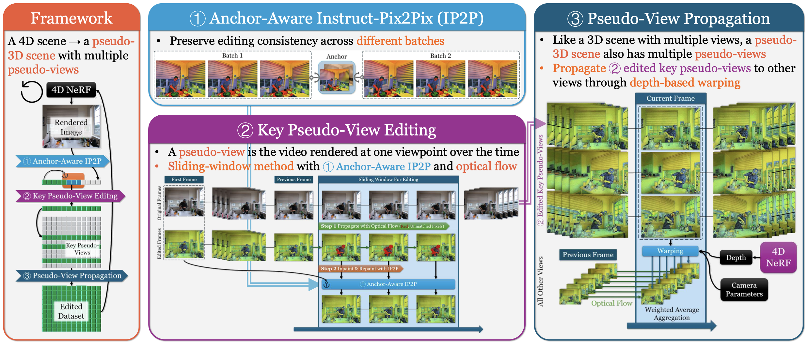

# Instruct-4D-to-4D

This is the official implementation of [Instruct 4D-to-4D](https://immortalco.github.io/Instruct-4D-to-4D/).



## Framework

### Anchor-Aware Instruct-Pix2Pix (IP2P)

### Key Pseido-View Editing


### Pseudo-View Propagation


## Tips

If your edit isn't working as you desire, it is likely because InstructPix2Pix struggles with your images and prompt. We recommend taking one of your training views and trying to edit it in 2D first with InstructPix2Pix, referring to the tips on getting a good edit can be found [here](https://github.com/timothybrooks/instruct-pix2pix#tips).

## Acknowledgement

We would like to thank [Liangchen Song](https://lsongx.github.io/index.html) for providing the codebase of [NeRFPlayer](https://lsongx.github.io/projects/nerfplayer.html) and helpful discussion. We also sincerely thank [Haque, Ayaan](https://www.cs.cmu.edu/~yenchenl/) for kind discussion about 3D scene editing.

## Citation

You can find our paper on [arXiv](https://arxiv.org/abs/2406.09402).

If you find this code or find the paper useful for your research, please consider citing:

```
@inproceedings{mou2024instruct,
  title={Instruct 4D-to-4D: Editing 4D Scenes as Pseudo-3D Scenes Using 2D Diffusion},
  author={Mou, Linzhan and Chen, Jun-Kun and Wang, Yu-Xiong},
  booktitle={Proceedings of the IEEE/CVF Conference on Computer Vision and Pattern Recognition},
  pages={20176--20185},
  year={2024}
}
```